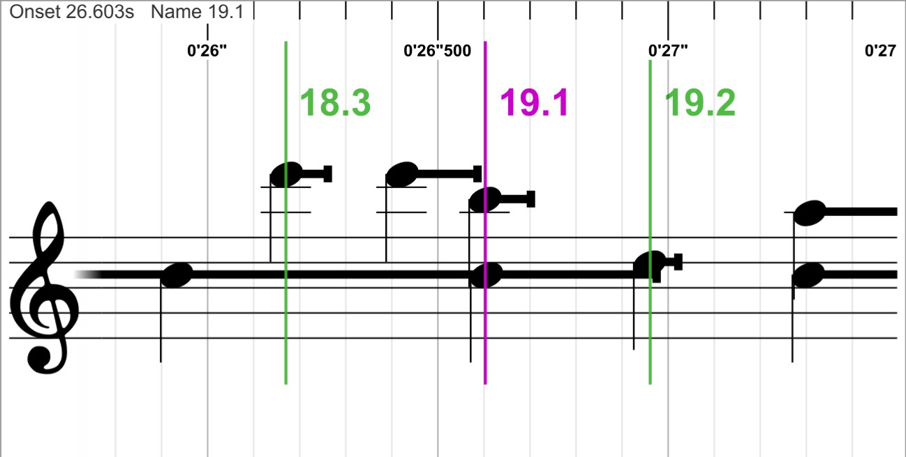
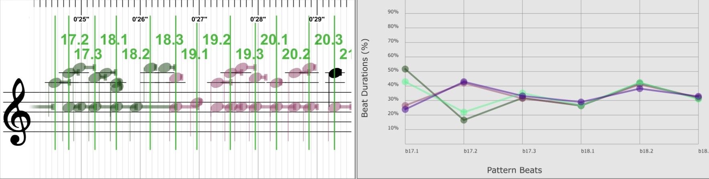
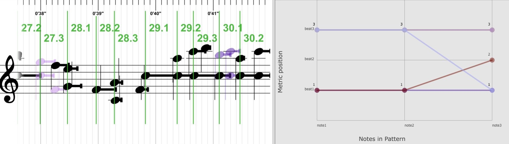

A work in progress.. Currently (28.01.21), all tools described below (1, 2 and 3) have been prototyped(!) successfully. There is, of course, major room for improvements, testing and experimentation.

# Brief Description of Proposed Toolbox

The tools are prototyped in MaxMSP v8, using the [Bach Library](https://www.bachproject.net/) (for score representation and visualization), Javascript (for list processing, logic and custom plotting), and Python (for further data science in the Jupyter Notebook environment). 

The overall concept is an environment of applications where you can easily import/export specific JSON files (dictionaries) between tools that perform different operations on computationally transcribed performances of Hardanger Fiddle music (specifically provided by the [MIRAGE Research Project](https://www.uio.no/ritmo/english/projects/mirage/)).

 

### 1. A dynamic beat duration "editor"

1. First off, this tool successfully converts all the necessary data from the MIRAGE .csv transcription data into dictionary format; including note onset ratios, note duration ratios, beat ratios, beat onset and durations, total tune duration, pitches etc.

	1. Sidenote - the dictionaries themselves can be useful and insightful for research. As shown in the jupyter notebook files in "src -> code -> python". 
2. Then, we actually use the dictionary (and it's ratios) to "recreate" the performance as notation in our score. Why this is a preferred solution will become apparent in the next point.

3. The main feature of the first tool is it's ability to dynamically change the beat onsets and subsequently their durations. The performance notation consist of notes and markers indicating the beat positions. The tool let's us manually drag and edit these markers, effectively shortening and elongating the beats in the performance. When we elongate one part and shorten another, the score is refreshed and all notes are scaled accordingly. This means that changing a beat's duration will alter the onset and duration of all it's notes, the notes in the neighbouring beat, the bar durations, and the overall track duration (sometimes). However, altering duration **ratios** of the beats will **not** affect the note's onset and duration **ratios**. For this concept to work, it's best to use the dictionary method mentioned for dynamic score creation.

**Some notes:**

* The note ratios are calculated with respects to their associated beat duration.
* The beat ratios are calculated with respect to their associated bar duration.
* We cannot drag a beat marker across one of its neighbouring beats. This will simply result in the beat markers changing their names and configurations to fit. (a nice little brag to myself here)

 
 

### 2. Exploring timing patterns of repeating motifs
This is an extension of the first tool, so it harbours all the features of tool 1.

1. First, we import a specific text file listing all the repeating harmonic patterns of the performance in question. The harmonic patterns (a list describing the location of the recurrent motifs in the performance) are then added to the dictionary in a specific format.

2. Then, we can select a bar/measure range, for instance from bar 1 to bar 3. The program will then see if your selection corresponds to any of the harmonic patterns. If it finds matches it colors ALL instances of the motif in the performance.

3. The main feature of this tool is its capability of plotting the timing patterns (in this case the **beat duration ratios**) of all the found motivic instances in a custom plot (built in jsui). We can then investigate how the timing of repeating motifs evolve over the course of the performance. We can of course also export the plotted data in a smaller, more concise dictionary format.

**Some notes:**
* The plotted info (beat duration ratios of the motifs) does not consider the motif duration as reference. Rather, the beat durations are calculated with respect to their associated bar, as brefly mentioned.

 

### 3. Investigate musical properties of recurrent instances of manually selected regions of notes, based on the selected regions timing pattern.

1. In this tool, we import the dictionary we created (and exported) in the first and second tool. The dictionary creates the score and every feature that is available in the first tool.

2. Then, we can manually select a region in the score, for instance 3 successive notes, with our mouse. The program will then collect the **note duration ratios** of the selected region and find other regions in the performance where the same timing pattern is present. So it finds recurrent instances of a manually selected region of notes, based on the selected regions timing pattern. Lastly it colors them in the score for visual inspection.
	1. Since the ratios in question are very specific (percentages with 2 or more decimal points), it's unlikely we find any 100% pattern matches of a manually selected region. Therefore, the tool features a "scale" slider. This slider lets you round all the note duration ratios to nearest N, making pattern finding much easier. So the higher the "scale" number is, the more rounded the ratios, the more patterns you will find.

3. Lastly, in this tool we can plot various musical properties of all the matching patterns, simultaneously. This enables us to quickly investigate commonalities across regions that share the same timing pattern. In the prototype, I feature these plotting possibilities:
	1. **Metric position**. This will plot the number of selected notes along the X-axis, and the metric position (beat 1, 2 or 3) on the Y-axis. This can help us to see if patterns with similar timing patterns share the same metrical positions, or not. 
	2. **Velocities**. As with the first point, we plot the number of selected notes along the X-axis, but have the note velocity on the Y-axis. This can help us to see if patterns with similar timing profiles share similar dynamics or not.
	3. **Pitch**. As with the first and second point, we plot the number of selected notes along the X-axis, but have the note pitches on the Y-axis. This can help us to see if patterns with similar timing profiles share similar harmonic content or not.

**Some notes:**
* Velocities are, for the time being, randomly generated and distributed because transcription data with note intensity (velocity) information has not yet been provided.  

 

## Additional Suggestions / Further Work

* None of the tools explore the timing patterns of ornamentations or how they relate to the "regular" notes. This could be worth looking into.

* In relation to tool nr.1; when changing the beat durations and ratios, we only do so locally. A nice idea would be to make a new tool, based on 1 and 2, where a local beat duration change would result in similar changes being made to all of it's associated harmonic patterns.

* In relation to tool nr.1; we could explore the possibility of change the note onset and duration ratios as well.
	
* In relation to tool nr.2; it will only find repeating harmonic patterns using the text file. It could be nice to actually detect repeating harmonic patterns in Max itself, using pitch. I do a similar kind of pattern detection in the third tool, when I look for similar note duration ratios throughout the track.
