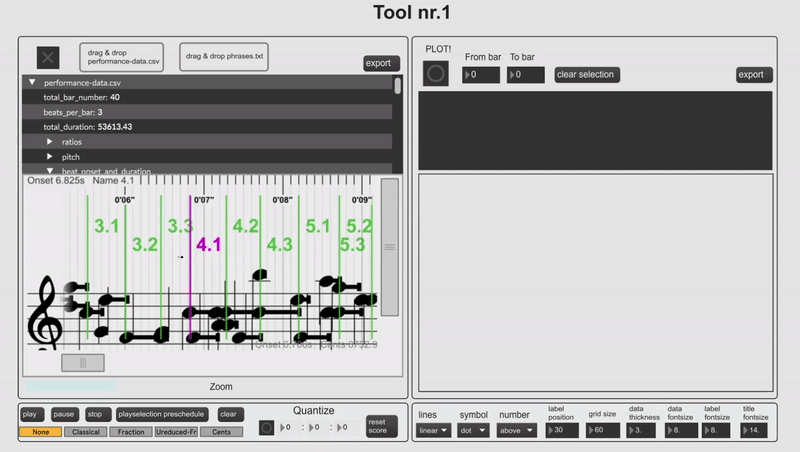

Two computational tools that enable structural and multi-dimensional perspectives on the complex rhythmical structuring of *springar* performances through interactive user interfaces. Implemented in MaxMSP, with the [Bach Library](https://www.bachproject.net/) and additional Javascript. Hardanger Fiddle Performance transcription provided by the [MIRAGE Research Project](https://www.uio.no/ritmo/english/projects/mirage/).

 

# License
This toolbox is released under the [GNU General Public License 3.0 license](https://www.gnu.org/licenses/gpl-3.0.en.html).