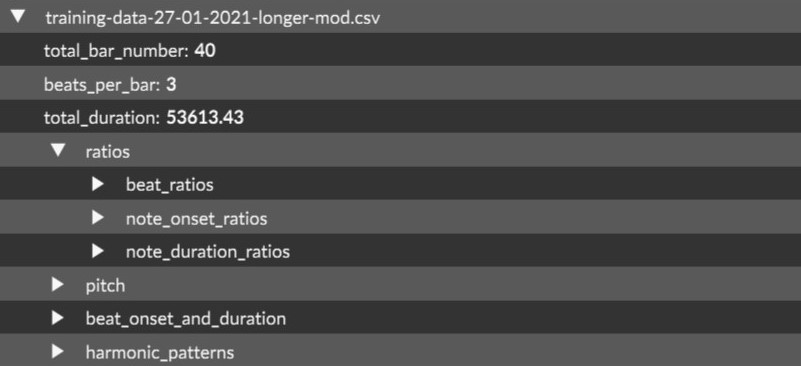
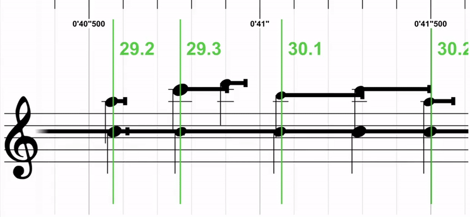
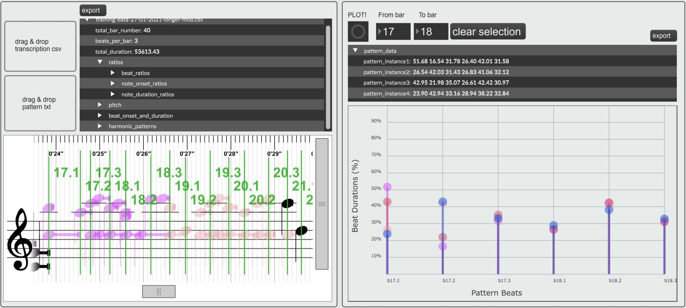
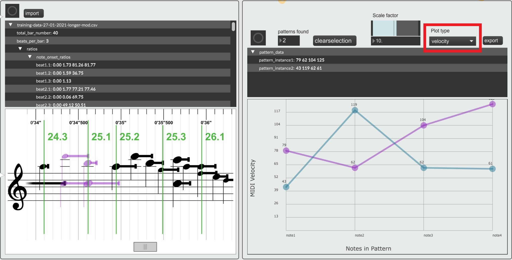

A work in progress..

## Table of Contents  
* [Short Introduction](#brief-description)  
* [Tool nr.1 and nr.2](#tool-nr1-and-nr2)
	* [1. The Editor](#1-the-editor)
	* [2. Timing Evolution of Repeating Structures (Motifs and/or phrases)](#2-timing-evolution-of-repeating-structures-motifs-andor-phrases)
	* [Further work suggestions](#further-work-suggestions)
* [Tool nr.3](#tool-nr3)
	* [3. Investigate Musical Properties of Recurring Timing Patterns](#3-investigate-musical-properties-of-recurring-timing-patterns)
	* [Further work suggestions](#further-work-suggestions-1)
* [References](#references)

 

# Short Introduction
These 3 prototyped tools examine performance patterns in traditional Norwegian folk music. To narrow the scope, I specifically focus on **timing patterns** in Hardanger fiddle performances. The tools examine these properties in 2 general ways; first, by looking at how timing patterns of repeating motifs (phrases/harmonic patterns) evolve over time, and second by investigating musical properties of repeating timing patterns (such as pitch, metrical position and dynamics).

Additionally, several data visualization techniques are featured, such as an interactive and adjustable score representation, coloring and dynamic plotting capabilities.

The tools are prototyped in MaxMSP v8, using the [Bach Library](https://www.bachproject.net/) (for score representation and visualization), Javascript (for list processing, logic and custom plotting), and Python (for further data science). The computationally annotated performances of Hardanger Fiddle music are provided by the [MIRAGE Research Project](https://www.uio.no/ritmo/english/projects/mirage/).

*PS: None of the proposed tools take ornamentations into account.. yet.*

# Tool nr.1 and nr.2
## 1. The Editor

 

* Converts all the necessary .csv peformance data into JSON format.*
	* Sidenote - these dictionaries provide the opportunity for interesting further music analysis, as shown in the jupyter notebook files in "src -> code -> python". 

* The JSON information (note-& beat level ratios) is then used to "recreate" the performance and beat markers as a score representation (mix between piano roll and score).

* We can dynamically change the beat lengths and onsets via simple click and drag. The score is then refreshed and all note relations are scaled accordingly. This means that editing the beat's will alter the onset and duration of all notes, but **not** the note ratios.

## 2. Timing Evolution of Repeating Structures (Motifs and/or phrases)

 

In this tool we define <b>timing patterns</b> as a sequence of <b>beat duration ratios</b>.

* We import a specific text file listing all the repeating motifs (phrases/harmonic patterns) of the performance. The list is added to the track JSON.

* By selecting a bar/measure range, for instance from bar-1 to bar-3, the program will see if the selection corresponds to any of the collected harmonic patterns (from the text file). If it finds matches, it colors ALL instances of the pattern in the score and plots the timing patterns of said instances in a custom plot.

* This enables us to investigate how the timing patterns of the recurring motifs in a performance, and their evolution over time. A technique similar to what is used in (Johansson 2019, p.5). We can of course also export the plotted data in a smaller, more concise JSON format.

## Further work suggestions
* when changing the beat onset and durations, we only do so in one place. If the beat being adjusted is part of a repeating motif (harmonic pattern), maybe a good idea would be to make the local change propegate to all instances of the motif. So all instances of the repeating motif would be subjected to the same changes.   

* Have a feature that enables us to instantly quantizes all the beats in the performance to have equal durations (based on the total duration of the performance). Then, users could try to "recreate" performance patterns by adjuting the beats.  

*The note ratios are calculated with respects to their associated beat duration. The beat ratios are calculated with respect to their associated bar duration.  

# Tool nr.3
## 3. Investigate Musical Properties of Recurring Timing Patterns.

 

In this tool we define <b>timing patterns</b> as a sequence of <b>note duration ratios</b>. (see <b>Further work suggestions</b> below for comments on this..)

* In this tool, we import the JSON we created (and exported) in the "tool nr.1 and 2". The JSON creates the score and every feature that is available in the first tool.

* If we manually select a region in the score, for instance 3 successive notes with our mouse, the program will collect the timing pattern of the selected region and find other regions in the performance where the same timing pattern occurs. Then it colors the regions and plots them for visual inspection.
	* Since the ratios in question are very specific (percentages with 2 or more decimal points), it's unlikely we find any 100% pattern matches of a manually selected region. Therefore, the tool features a "scale" slider. This slider lets you round all ratios to nearest N, making pattern finding much easier. So the higher the "scale" number is, the more patterns you will find.

* We can plot various musical properties which enables quick inspection of commonalities across regions that share the same timing pattern. In the prototype, I feature these plotting possibilities:
	1. **Metric position**. This will plot the number of selected notes along the X-axis, and the metric position (beat 1, 2 or 3) on the Y-axis. This can help us to see if patterns with similar timing patterns share the same metrical positions, or not. 
	2. **Velocities**. As with the first point, we plot the number of selected notes along the X-axis, but have the note velocity on the Y-axis. This can help us to see if patterns with similar timing profiles share similar dynamics or not.
	3. **Pitch**. As with the first and second point, we plot the number of selected notes along the X-axis, but have the note pitches on the Y-axis. This can help us to see if patterns with similar timing profiles share similar harmonic content or not.

## Further work suggestions
* This first iteration of "tool nr.3" is a simple proof of concept. Instead of just finding similar sequences of note durations, we should try to find sequences of **inter onset intervals**, or something similar. The current system design can support alteration to our current definition of what a "timing pattern" is. 

* Velocities are, for the time being, randomly generated because transcription data with note dynamics (velocity information) has not yet been provided to me. The velocity of a note is indicated by the size of its notehead. The bigger the louder.

# References
Johansson, M. (2019). Timing-sound interactions in traditional Scandinavian fiddle music: Preliminary and implications. EasyChair Preprint, 5.
